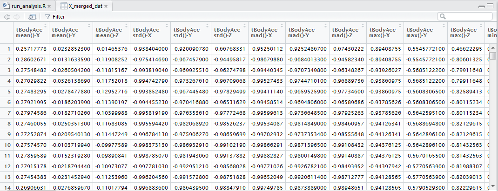

# Getting and Cleaning Data Course Project

The peer graded assignment in the Coursera course, "Getting and Cleaning Data" requires :
<ol><li>Tidy data set created in step 5 of the instructions</li>
<li>Script (run_analysis.R)</li>
<li>A README.md in the repo describing how the script works and the code book describing the variables</li></ol>

and all of them i put it in this Github repo

In this README.md, contains about the repo describing how the **script works** and the **code book** describing the variables step by step, i hope this easy to understand.

below the steps:

### Step 0A, Download file
Download file from https://d396qusza40orc.cloudfront.net/getdata%2Fprojectfiles%2FUCI%20HAR%20Dataset.zip and extract it. 

Using __getwd()__ to check working directory. and then put downloded file in that directory. 
it will make easier to locate the path file, using "./". 

### Step 0B, listed all files

#### Define all files 
##### Test files:
<ol><li>f_subject_test <- "./UCI HAR Dataset/test/subject_test.txt"  </li>
<li>f_X_test <- "./UCI HAR Dataset/test/X_test.txt" </li>
<li>f_Y_test <- "./UCI HAR Dataset/test/y_test.txt" </li>
</ol>

##### Train Files:
<ol><li>f_subject_train <-"./UCI HAR Dataset/train/subject_train.txt"</li>
<li>f_X_train <- "./UCI HAR Dataset/train/X_train.txt"</li>
<li>f_Y_train <- "./UCI HAR Dataset/train/y_train.txt"</li>
</ol>

##### Activity file:
<ol><li>f_activity_labels <-"./UCI HAR Dataset/activity_labels.txt"</li></ol>

##### Features file:
<ol><li>f_features <- "./UCI HAR Dataset/features.txt"</li></ol>

variable with prefix "f_", means for file path 

### Step 0C,  load all files to memory
  
#### Read the files :
##### Read test files
<ol><li>subject_test_dat <- read.table(f_subject_test)</li>
   <li>X_test_dat <- read.table(f_X_test)</li>
    <li>Y_test_dat <- read.table(f_Y_test)</li></ol>
    
##### Read training data
<ol><li>subject_train_dat <- read.table(f_subject_train)</li>
    <li>X_train_dat <- read.table(f_X_train)</li>
    <li>Y_train_dat <- read.table(f_Y_train)</li></ol>
    
##### Read features and activities
<ol><li>activity_labels_dat <- read.table(f_activity_labels)</li>
   <li>features_dat <- read.table(f_features)</li></ol>
  
### Step 1, Merge test and training data set

In this step, files that already readed at step 1B will be merged using rbind and rbind.
*for more detail regading rbind and cbind you can check using ?rbind or ?cbind. 

#### Merge X train and test
<ol><li>X_merged_dat <- rbind(X_test_dat, X_train_dat)</li></ol>

to check it, you can check based on dimension dim(X_test_dat), dim(X_train_dat) and dim(X_merged_dat). Also you can View one by one each variables.
Please find below result from View(X_merged_dat).

#### Set column names using features.txt
<ol><li>colnames(X_merged_dat) <- as.character(features_dat[,2])</li></ol>

#### Merge subject
<ol><li>subject_merged_dat <- rbind(subject_train_dat, subject_test_dat)</li></ol>

#### Merge Y train and test
<ol><li>Y_merged_dat <- rbind(Y_train_dat, Y_test_dat)</li></ol>

#### Create one data set from merge subject and Y
<ol><li>Y_subject_merged_dat <- cbind(subject_merged_dat, Y_merged_dat)</li></ol>

  
### Step 2, Extracts only the measurements on the mean and standard deviation for each measurement

Using grep("mean\\(\\)|std\\(\\)", names(X_merged_dat)) to extracts **mean and standard deviation** from column names in X_merged_dat
  
		Col_mean_std <- grep("mean\\(\\)|std\\(\\)", names(X_merged_dat))

and then get data from X_merged_dat which has column name in Col_mean_std

		X_mean_std_dat <- X_merged_dat [,Col_mean_std]

Please find below result from View(X_mean_std_dat).

### Step 3, Uses descriptive activity names to name the activities in the data set

Get and uses descriptive activity names.
  <ol><li>
activity_labels <- activity_labels_dat$V2[Y_subject_merged_dat[,2]]</li>
<li>Y_subject_merged_dat$activity_label <- activity_labels
</li></ol>

### Step 4, Appropriately labels the data set with descriptive variable names.

Put labels to the data set with descriptive variable names.
  <ol><li>combine_dat <- cbind(Y_subject_merged_dat, X_mean_std_dat)</li>
	<li>colnames(combine_dat)[1:2] <- c("Subject", "Activity_ID")</li></ol>

  
### Step 5, Creates a second, independent tidy data set with the average of each variable for each activity and each subject

Creating independent tidy data set with the **average of each variable for each activity and each subject** using _aggregate.data.frame_. 

Function aggregate.data.frame is the data frame method. If x is not a data frame, it is coerced to one, which must have a non-zero number of rows. Then, each of the variables (columns) in x is split into subsets of cases (rows) of identical combinations of the components of by, and FUN is applied to each such subset with further arguments in ... passed to it. The result is reformatted into a data frame containing the variables in by and x. The ones arising from by contain the unique combinations of grouping values used for determining the subsets, and the ones arising from x the corresponding summaries for the subset of the respective variables in x. If simplify is true, summaries are simplified to vectors or matrices if they have a common length of one or greater than one, respectively; otherwise, lists of summary results according to subsets are obtained. Rows with missing values in any of the by variables will be omitted from the result. (Note that versions of R prior to 2.11.0 required FUN to be a scalar function.).

    avg_combine_dat <- aggregate.data.frame(combine_dat, list(combine_dat$Subject, combine_dat$activity_label), mean)[, c(-3, -5)]
 
After we did aggregation, simply labeling with descriptive variable names.

    colnames(avg_combine_dat)[1:2] <- c("Subject", "Activity_Label")

after everything good, create file _average_Per_Subject.txt_ with write.table() using row.name=FALSE.

    write.table(avg_combine_dat,"average_Per_Subject.txt",row.names=FALSE)

 
